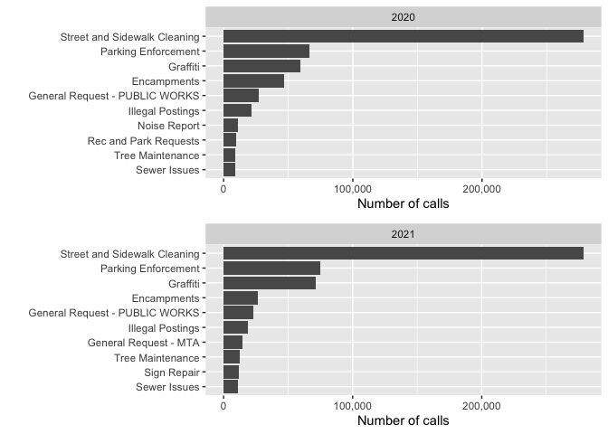

README
================

# Exploratory Data Analysis of 3-1-1 calls using SQL

In this project, I explore 311 calls from the city of San Francisco. The
data comes from Google Cloud’s Public Dataset Program.

The R package BigRQuery was used to query, download, and convert the
data into a data frame. Packages used include ggplot2, dplyr, tidyverse,
knitr, grid, and DBI for authenticating the connection to BigQuery.

# What are the top 10 reasons people call 3-1-1 in San Francisco?

Let’s explore the top 10 complaints from people who called 3-1-1. We’ll
write the query so that we can specify the year and rank categories
based on how many how many complaints were received. Furthermore, the
query can tell us whether two category ranks are equal (tied) since we
avoid use of the LIMIT function.

For the purposes of exploration we’ll take a look at the top 10
categories for 2020 and 2021.

``` sql
--Create a table with year, category, and number of requests
WITH popular_categories AS (
    SELECT EXTRACT(YEAR FROM created_date) AS year,
       category,
       COUNT(unique_key) AS n
    FROM `bigquery-public-data.san_francisco_311.311_service_requests` 
    WHERE created_date BETWEEN '2020-01-01 00:00:00' AND '2021-12-31 23:59:59'
    GROUP BY 1,2)

--Rank each category according to number of requests
SELECT year,
       category,
       n, 
       rank_cat
FROM (
    SELECT year,
       category,
       n, 
       RANK() OVER(
            PARTITION BY year
            ORDER BY n DESC
       ) AS rank_cat
    FROM popular_categories
       ) AS ranked_categories

WHERE rank_cat <= 10 --input the top rank number you want to see
```

``` r
options(scipen=10000) #remove scientific notation using options method

#Plot the number of calls from each source per year

#Create a function for plotting years 2020 and 2021 in a grid
plot_top10catPerYear <- function(choose_year){
ggplot(data=df_top10catPerYear %>% filter(year==choose_year),
  aes(x=reorder(category,-rank_cat), y=n)) + #Sort data in descending order
    geom_col() +
    theme(legend.title=element_blank()) +
    scale_y_continuous(label=comma) +
    ylab('Number of calls') + 
    xlab(' ') +
    coord_flip() + 
    facet_wrap(~year) + 
    scale_color_manual(values=c("purple"))
  
}

#Create a grid to plot years 2020 and 2021
plot_grid (plot_top10catPerYear(2020),
           plot_top10catPerYear(2021),
           nrow = 2,
           align = "v",
           labels = " "
)
```

<!-- -->

# Year-on-year growth of top 6 complaint categories

The top 6 categories in number of complaints has remained consistent
from 2020 to 2021. Are these categories improving at all? What is the
year-over-year growth for these top 6 categories?

``` sql
WITH popular_categories AS (
    SELECT EXTRACT(YEAR FROM created_date) AS year,
       category,
       COUNT(unique_key) AS n
    FROM `bigquery-public-data.san_francisco_311.311_service_requests` 
    WHERE created_date BETWEEN '2020-01-01 00:00:00' AND '2021-12-31 23:59:59'
    GROUP BY 1,2),

ranked_categories AS (
       SELECT year,
       category,
       n, 
       rank_cat
FROM (
    SELECT year,
       category,
       n, 
       RANK() OVER(
            PARTITION BY year
            ORDER BY n DESC
       ) AS rank_cat
    FROM popular_categories
       ) AS ranked_categories

WHERE rank_cat <= 6 --input the top rank number you want to see
)

--Calculate the year-on-year growth for the top 6 categories (which remained consistent from 2020 to 2021)
SELECT curr.category AS category,
       100*((curr.n/prev.n) - 1) AS yoygrowth_2020to2021
FROM ranked_categories curr
     JOIN ranked_categories prev
     ON curr.category = prev.category
     AND prev.year = curr.year - 1 --join table to itself based on 2020 and 2021 years
```

``` r
library(stringr) #Wrap labels for long category names
#Create plot that shows year-on-year growth for 2020-2021
ggplot(data=df_top6catYoY, mapping = aes(x=category, y=yoygrowth_2020to2021))+ 
  geom_col() + 
  labs(
    title="Year-on-year (2020-2021) growth per complaint category",
    x="Complaint",
    y="Percent growth"
  ) +
  ylim(-50,25) +
  scale_x_discrete(labels = wrap_format(10))
```

<!-- -->

# Response time for most popular category

The “Street and sidewalk cleanings” category is consistently in the top
of the rankings. How long did it take to resolve this issue, on average?
We’ll explore years 2019, 2020, and 2021.

``` sql
--Calculate the response/resolution time per year
WITH cte_respTime AS (
    SELECT created_date,
           TIMESTAMP_DIFF(resolution_action_updated_date, created_date, MINUTE) AS respTime
    FROM `bigquery-public-data.san_francisco_311.311_service_requests` 
    WHERE created_date BETWEEN '2019-01-01 00:00:00' AND '2021-12-31 23:59:59'
    AND category = 'Street and Sidewalk Cleaning'
)

--Calculate the average response time for each year using CASE:
SELECT AVG(CASE WHEN created_date BETWEEN '2019-01-01 00:00:00' AND '2019-12-31 23:59:59' THEN respTime ELSE NULL END) AS avg_responseTime_2019,
       AVG(CASE WHEN created_date BETWEEN '2020-01-01 00:00:00' AND '2020-12-31 23:59:59' THEN respTime ELSE NULL END) AS avg_responseTime_2020,
       AVG(CASE WHEN created_date BETWEEN '2021-01-01 00:00:00' AND '2021-12-31 23:59:59' THEN respTime ELSE NULL END) AS avg_responseTime_2021
FROM cte_respTime
```

``` r
knitr::kable(avg_respTime_topCat/1440, col.names = c("2019", "2020", "2021"), caption="Average response times by year", format="markdown") #Response time is in minutes. Divided by 1440 to get response time in number of days.
```

|     2019 |     2020 |     2021 |
|---------:|---------:|---------:|
| 4.745264 | 3.046477 | 2.382411 |

Average response times by year

The resolution times range from 2 to 4 days. Difficulties in updating
resolution times are mentioned in the SF 311 documentation, which might
be why these resolution times are so long. We must be careful in how we
interpret this data.

# Average number of daily calls for most popular category (Street and Sidewalk Cleaning)

Let’s look at the average number of daily calls for ‘Street and Sidewalk
Cleaning’, per year for years 2019, 2020, and 2021.

``` sql
--Average daily calls per year = (total number of calls per day)/(number of days)
--First find (total number of calls per day) in cte:
WITH cte_avgdailycalls AS (
    SELECT DATE_TRUNC(created_date, YEAR) as year,
           DATE_TRUNC(created_date, DAY) AS day,
           COUNT(unique_key) AS daily_calls
    FROM `bigquery-public-data.san_francisco_311.311_service_requests`
    WHERE created_date BETWEEN '2019-01-01 00:00:00' AND '2021-12-31 23:59:59'
    AND category = 'Street and Sidewalk Cleaning'
    GROUP BY 1,2
)

--calculate the average number of calls per day in a year by using AVG() 
SELECT AVG(CASE WHEN year BETWEEN '2019-01-01 00:00:00' AND '2019-12-31 23:59:59' THEN daily_calls ELSE NULL END) AS avg_dailycalls2019,
       AVG(CASE WHEN year BETWEEN '2020-01-01 00:00:00' AND '2020-12-31 23:59:59' THEN daily_calls ELSE NULL END) AS avg_dailycalls2020,
       AVG(CASE WHEN year BETWEEN '2021-01-01 00:00:00' AND '2021-12-31 23:59:59' THEN daily_calls ELSE NULL END) AS avg_dailycalls2021
FROM cte_avgdailycalls
```

``` r
knitr::kable(avg_dailyPerYear, col.names = c("2019", "2020", "2021"), caption="Average daily calls per year", format="markdown")
```

|    2019 |     2020 |     2021 |
|--------:|---------:|---------:|
| 678.589 | 760.8142 | 763.7863 |

Average daily calls per year

``` r
#Avg number of daily calls per year.
```

It looks like the average number of calls per day for ‘Street and
Sidewalk Cleaning’ has increased from 2019 to 2021, with a slower
increase from 2020 to 2021.

# Response time per complaint category

Let’s explore the resolution time per complaint category, while
remaining cautious as to the nature of resolution time due to the
challenges in data collection mentioned above.

What are the longest resolution times per complaint category in 2021?

``` sql
--Find average resolution times for each year and store in cte
WITH cte_respTimeCat AS (
    SELECT EXTRACT(YEAR FROM created_date) as year,
           category, 
           AVG(TIMESTAMP_DIFF(resolution_action_updated_date, created_date, MINUTE)) AS avg_catrespTime
    FROM `bigquery-public-data.san_francisco_311.311_service_requests` 
    WHERE created_date BETWEEN '2019-01-01 00:00:00' AND '2021-12-31 23:59:59'
    GROUP BY 1,2
)

--Rank the resolution times in desc order
SELECT year, category, avg_catrespTime, rank_cat
FROM (SELECT year, category, avg_catrespTime, 
       RANK() OVER(PARTITION BY year ORDER BY avg_catrespTime DESC) AS rank_cat
       FROM cte_respTimeCat
       WHERE avg_catrespTime != 0 AND avg_catrespTime < 525600 
) -- response time within the created_date year
WHERE rank_cat <= 10
```

``` r
#Plot and sort data in descending order for year 2021
ggplot(data=respTimeCat_long %>% filter(year==2021),
         aes(x=reorder(category,-rank_cat), y=avg_catrespTime/1440)) + #Convert minutes to days
    geom_col() +
    scale_y_continuous(label=comma) +
    ylab('Resolution time (days)') + 
    xlab(' ') +
    theme(legend.title=element_blank()) +
    coord_flip() 
```

<!-- -->

What’s the shortest response times per issue/category in 2021?

``` sql
--Calculate the average response times per year per issue category
WITH cte_respTimeCat AS (
    SELECT EXTRACT(YEAR FROM created_date) AS year,
           category, 
           AVG(TIMESTAMP_DIFF(resolution_action_updated_date, created_date, MINUTE)) AS avg_catrespTime
    FROM `bigquery-public-data.san_francisco_311.311_service_requests` 
    WHERE created_date BETWEEN '2019-01-01 00:00:00' AND '2021-12-31 23:59:59'
    GROUP BY 1,2
)

--Rank resolution times per year in asc order
SELECT year, category, avg_catrespTime, rank_cat
FROM (SELECT year, category, avg_catrespTime, 
       RANK() OVER(PARTITION BY year ORDER BY avg_catrespTime ASC) AS rank_cat
       FROM cte_respTimeCat
       WHERE avg_catrespTime != 0 AND avg_catrespTime < 525600 
       -- response time within the created_date year
)
WHERE rank_cat <= 10
```

``` r
#Plot and sort the resolution times for the year 2021
ggplot(data=respTimeCat_short %>% filter(year==2021),
         aes(x=reorder(category,-rank_cat), y=avg_catrespTime/1440)) + #Convert minutes to days 
    geom_col() +
    ylab('Resolution time (days)') + 
    xlab(' ') +
    coord_flip() + 
    theme(legend.title=element_blank()) 
```

<!-- -->

Note that the first four categories have resolution times less than 1
day. The resolution times for the first four categories plotted above
are 1.8, 2.7, 3.0, and 8.6 minutes.

# Mobile, phone, and other sources of 3-1-1 requests

What was the total number of requests by source (mobile, phone, etc.)
per year from 2019-2021?

``` sql
SELECT  DATE_TRUNC(created_date, YEAR) AS year,
        source,
        COUNT(unique_key) AS n
    FROM `bigquery-public-data.san_francisco_311.311_service_requests` 
    WHERE created_date BETWEEN '2019-01-01 00:00:00' AND '2021-12-31 23:59:59'
    GROUP BY 1,2
    ORDER BY 2 DESC
```

``` r
#Prepare to plot the number of calls from each source per year
options(scipen=10000) #remove scientific notation using options method

#GGplot the number of calls from each source per year
ggplot(data=df_sourcePerYear, aes(x=year, y=n, fill=source)) + 
  geom_col() +
  theme(legend.title=element_blank()) +
  scale_y_continuous(label=comma) +
  xlab('Year') +
  ylab('Total number of calls') 
```

<!-- --> From the
graph above, Mobile/Open311 consistently serves as the largest source of
311 calls from 2019-2021.
