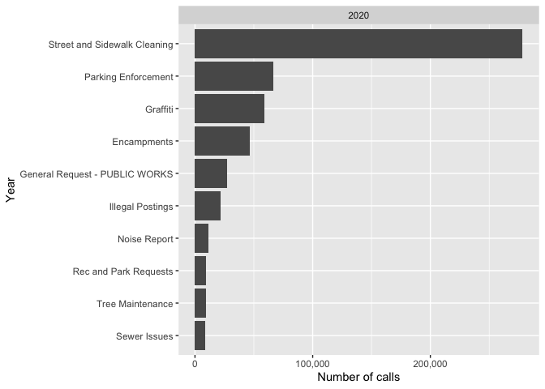
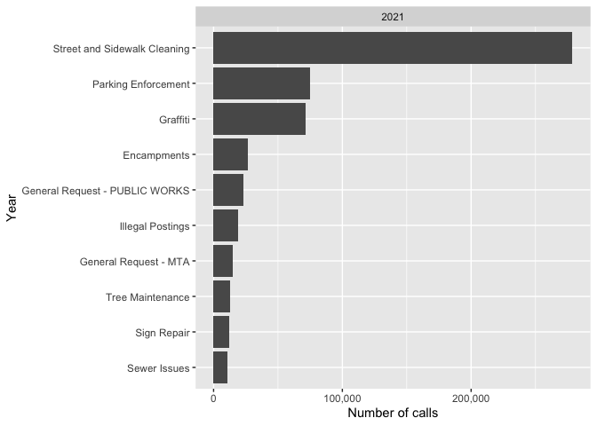
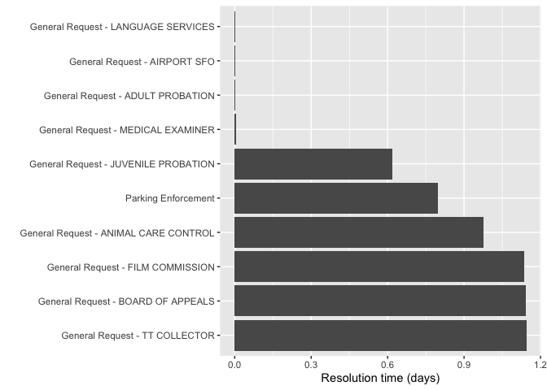

README
================

# Exploratory Data Analysis of 3-1-1 calls using SQL

In this report, I explore 311 calls from the city of San Francisco. This
data is publically available on Google Cloud BigQuery. The R package
BigRQuery was used to query, download, and convert the data into a
dataframe.

# What are the top 10 reasons people call 3-1-1 in San Francisco?

Let’s explore the top 10 requests from people who called 3-1-1 during
the years 2019 thru 2021. We’ll write the query so that we can specify
year, and rank the number of calls in each category. Furthermore, the
query can tell us whether two category ranks are equal (tied) since we
avoid use of the LIMIT function.

``` sql
WITH popular_categories AS (
    SELECT EXTRACT(YEAR FROM created_date) AS year,
       category,
       COUNT(unique_key) AS n
    FROM `bigquery-public-data.san_francisco_311.311_service_requests` 
    WHERE created_date BETWEEN '2019-01-01 00:00:00' AND '2021-12-31 23:59:59'
    GROUP BY 1,2)

SELECT year,
       category,
       n, 
       rank_cat
FROM (
    SELECT year,
       category,
       n, 
       RANK() OVER(
            PARTITION BY year
            ORDER BY n DESC
       ) AS rank_cat
    FROM popular_categories
       ) AS ranked_categories

WHERE rank_cat <= 10 --input the top rank number you want to see
```

``` r
library(scales)
```

    ## 
    ## Attaching package: 'scales'

    ## The following object is masked from 'package:purrr':
    ## 
    ##     discard

    ## The following object is masked from 'package:readr':
    ## 
    ##     col_factor

``` r
options(scipen=10000) #remove scientific notation using options method

#Plot the number of calls from each source per year

plot_top10catPerYear <- function(choose_year){
  
  ggplot(data=df_top10catPerYear %>% filter(year==choose_year),
       aes(x=reorder(category,-rank_cat), y=n)) + #Sort data in descending order
  geom_col() +
  theme(legend.title=element_blank()) +
  scale_y_continuous(label=comma) +
  xlab('Year') +
  ylab('Number of calls') + 
  coord_flip() + 
  facet_wrap(~year) + 
  scale_color_manual(values=c("purple"))

}

plot_top10catPerYear(2019)
```

<!-- -->

``` r
plot_top10catPerYear(2020)
```

<!-- -->

``` r
plot_top10catPerYear(2021)
```

<!-- -->

# Response time for most popular category

Street and sidewalk cleanings are consistently in the top of the
rankings. How long did it take to resolve this issue, on average?

``` sql
--Calculate the response/resolution time per year
WITH cte_respTime AS (
    SELECT created_date,
           TIMESTAMP_DIFF(resolution_action_updated_date, created_date, MINUTE) AS respTime
    FROM `bigquery-public-data.san_francisco_311.311_service_requests` 
    WHERE created_date BETWEEN '2019-01-01 00:00:00' AND '2021-12-31 23:59:59'
    AND category = 'Street and Sidewalk Cleaning'
)

--Calculate the average response time for each year using CASE:
SELECT AVG(CASE WHEN created_date BETWEEN '2019-01-01 00:00:00' AND '2019-12-31 23:59:59' THEN respTime ELSE NULL END) AS avg_responseTime_2019,
       AVG(CASE WHEN created_date BETWEEN '2020-01-01 00:00:00' AND '2020-12-31 23:59:59' THEN respTime ELSE NULL END) AS avg_responseTime_2020,
       AVG(CASE WHEN created_date BETWEEN '2021-01-01 00:00:00' AND '2021-12-31 23:59:59' THEN respTime ELSE NULL END) AS avg_responseTime_2021
FROM cte_respTime
```

``` r
knitr::kable(avg_respTime_topCat/1440, format="markdown") #Response time is in minutes. Divided by 1440 to get response time in number of days.
```

| avg_responseTime_2019 | avg_responseTime_2020 | avg_responseTime_2021 |
|----------------------:|----------------------:|----------------------:|
|              4.745264 |              3.046477 |              2.262888 |

The resolution time is on the order of days. Difficulties in updating
resolution times are mentioned in the SF 311 documentation, which might
be why these resolution times are so long. We must be careful in how we
interpret this data.

# Average number of daily calls for most popular category (Street and Sidwalk Cleaning)

Let’s look at the average number of daily calls for ‘Street and Sidewalk
Cleaning’, per year for years 2019, 2020, and 2021.

``` sql
--Average daily calls per year = (total number of calls per day)/(number of days)
--First find (total number of calls per day) in cte:
WITH cte_avgdailycalls AS (
    SELECT DATE_TRUNC(created_date, YEAR) as year,
           DATE_TRUNC(created_date, DAY) AS day,
           COUNT(unique_key) AS daily_calls
    FROM `bigquery-public-data.san_francisco_311.311_service_requests`
    WHERE created_date BETWEEN '2019-01-01 00:00:00' AND '2021-12-31 23:59:59'
    AND category = 'Street and Sidewalk Cleaning'
    GROUP BY 1,2
)

--calculate the average number of calls per day in a year by using AVG() 
SELECT AVG(CASE WHEN year BETWEEN '2019-01-01 00:00:00' AND '2019-12-31 23:59:59' THEN daily_calls ELSE NULL END) AS avg_dailycalls2019,
       AVG(CASE WHEN year BETWEEN '2020-01-01 00:00:00' AND '2020-12-31 23:59:59' THEN daily_calls ELSE NULL END) AS avg_dailycalls2020,
       AVG(CASE WHEN year BETWEEN '2021-01-01 00:00:00' AND '2021-12-31 23:59:59' THEN daily_calls ELSE NULL END) AS avg_dailycalls2021
FROM cte_avgdailycalls
```

``` r
avg_dailyPerYear #Avg number of daily calls per year.
```

    ## # A tibble: 1 × 3
    ##   avg_dailycalls2019 avg_dailycalls2020 avg_dailycalls2021
    ##                <dbl>              <dbl>              <dbl>
    ## 1               679.               761.               764.

It looks like the average number of calls per day for ‘Street and
Sidewalk Cleaning’ has increased from 2019 to 2021, with a slower
increase from 2020 to 2021.

# Response time per issue category

Let’s explore the resolution time per issue category, while remaining
cautious as to the nature of resolution time due to the challenges in
data collection mentioned above.

What are the longest resolution times per issue category?

``` sql
WITH cte_respTimeCat AS (
    SELECT DATE_TRUNC(created_date, YEAR) as year,
           category, 
           AVG(TIMESTAMP_DIFF(resolution_action_updated_date, created_date, MINUTE)) AS avg_catrespTime
    FROM `bigquery-public-data.san_francisco_311.311_service_requests` 
    WHERE created_date BETWEEN '2019-01-01 00:00:00' AND '2021-12-31 23:59:59'
    GROUP BY 1,2
)

SELECT year, category, avg_catrespTime, rank_cat
FROM (SELECT year, category, avg_catrespTime, 
       RANK() OVER(PARTITION BY year ORDER BY avg_catrespTime DESC) AS rank_cat
       FROM cte_respTimeCat
       WHERE avg_catrespTime != 0 AND avg_catrespTime < 525600 
) -- response time within the created_date year
WHERE rank_cat <= 10
```

``` r
respTimeCat_long
```

    ## # A tibble: 30 × 4
    ##    year                category                         avg_catrespTime rank_cat
    ##    <dttm>              <chr>                                      <dbl>    <int>
    ##  1 2019-01-01 00:00:00 General Request - OCC                    519120.        1
    ##  2 2019-01-01 00:00:00 General Request - ETHICS COMMIS…         501643.        2
    ##  3 2019-01-01 00:00:00 Temporary Sign Request                   478375.        3
    ##  4 2019-01-01 00:00:00 General Request - DTIS                   391281.        4
    ##  5 2019-01-01 00:00:00 General Request - SHERIFF                341862.        5
    ##  6 2019-01-01 00:00:00 General Request - ADULT PROBATI…         324173         6
    ##  7 2019-01-01 00:00:00 General Request - MOCD                   313976.        7
    ##  8 2019-01-01 00:00:00 General Request - FIRE DEPARTME…         306103.        8
    ##  9 2019-01-01 00:00:00 General Request - STATUS OF WOM…         301008         9
    ## 10 2019-01-01 00:00:00 General Request - CONTRACT ADMI…         299885.       10
    ## # … with 20 more rows

What’s the shortest response times per issue/category?

``` sql
WITH cte_respTimeCat AS (
    SELECT DATE_TRUNC(created_date, YEAR) as year,
           category, 
           AVG(TIMESTAMP_DIFF(resolution_action_updated_date, created_date, MINUTE)) AS avg_catrespTime
    FROM `bigquery-public-data.san_francisco_311.311_service_requests` 
    WHERE created_date BETWEEN '2019-01-01 00:00:00' AND '2021-12-31 23:59:59'
    GROUP BY 1,2
)

SELECT year, category, avg_catrespTime, rank_cat
FROM (SELECT year, category, avg_catrespTime, 
       RANK() OVER(PARTITION BY year ORDER BY avg_catrespTime ASC) AS rank_cat
       FROM cte_respTimeCat
       WHERE avg_catrespTime != 0 AND avg_catrespTime < 525600 
       -- response time within the created_date year
)
WHERE rank_cat <= 10
```

``` r
respTimeCat_short
```

    ## # A tibble: 30 × 4
    ##    year                category                         avg_catrespTime rank_cat
    ##    <dttm>              <chr>                                      <dbl>    <int>
    ##  1 2020-01-01 00:00:00 General Request - PUBLIC DEFEND…              4         1
    ##  2 2020-01-01 00:00:00 General Request - GRANTS FOR TH…              7         2
    ##  3 2020-01-01 00:00:00 General Request - ADULT PROBATI…             23         3
    ##  4 2020-01-01 00:00:00 General Request - ANIMAL CARE C…           1237.        4
    ##  5 2020-01-01 00:00:00 General Request - HUMAN RIGHTS …           1480.        5
    ##  6 2020-01-01 00:00:00 Parking Enforcement                        1850.        6
    ##  7 2020-01-01 00:00:00 General Request - AGING ADULT S…           2769         7
    ##  8 2020-01-01 00:00:00 General Request - FILM COMMISSI…           3151.        8
    ##  9 2020-01-01 00:00:00 General Request - AIRPORT SFO              3332         9
    ## 10 2020-01-01 00:00:00 General Request - HUMAN SERVICE…           3814.       10
    ## # … with 20 more rows

# Mobile, phone, and other sources of 3-1-1 requests

What was the total number of requests by source (mobile, phone, etc.)
per year?

``` sql
SELECT  DATE_TRUNC(created_date, YEAR) AS year,
        source,
        COUNT(unique_key) AS n
    FROM `bigquery-public-data.san_francisco_311.311_service_requests` 
    WHERE created_date BETWEEN '2019-01-01 00:00:00' AND '2021-12-31 23:59:59'
    GROUP BY 1,2
    ORDER BY 2 DESC
```

``` r
library(scales)

options(scipen=10000) #remove scientific notation using options method

#Plot the number of calls from each source per year
ggplot(data=df_sourcePerYear, aes(x=year, y=n, fill=source)) + 
  geom_col() +
  theme(legend.title=element_blank()) +
  scale_y_continuous(label=comma) +
  xlab('Year') +
  ylab('Total number of calls') 
```

<!-- --> From the
graph above, Mobile/Open311 consistently serves as the largest source of
311 calls from 2019-2021.
